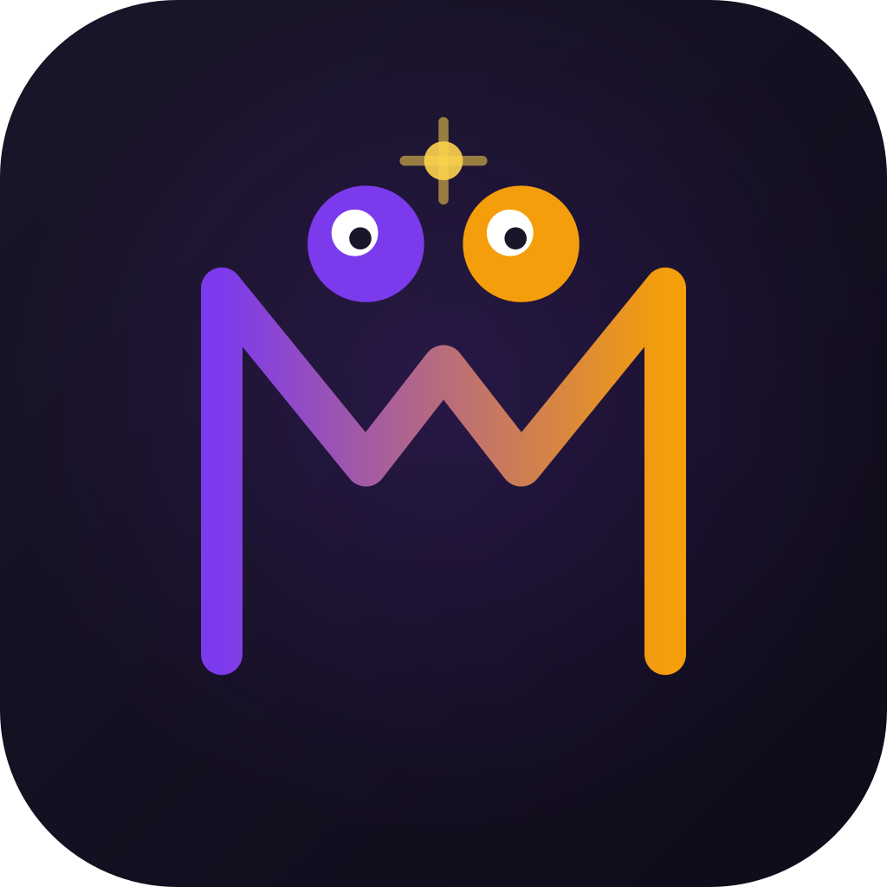

# Mind Match / Akıl Tutulması

<div align="center">



### Farklı Düşün, Puan Kazan! / Think Different, Score Points!

A real-time multiplayer emoji telepathy game for iOS and Android.

Pick the emoji **no one else** picks. Unique choice = point. First to the target score wins.

**TR:** Kimsenin seçmeyeceği emojiyi seç. Benzersiz seçim = puan. Hedef puana ilk ulaşan kazanır.

[Getting Started](#getting-started) · [How to Play](#how-to-play) · [Tech Stack](#tech-stack) · [Project Structure](#project-structure)

</div>

---

## How to Play

1. **N players** are shown **N emojis** at the start of each round
2. Each player **secretly picks** one emoji within 15 seconds
3. After all picks are locked in, everyone's choices are revealed
4. Players who picked a **unique emoji** (no one else picked it) earn **+1 point**
5. Players who picked the **same emoji** as someone else earn **0 points**
6. First player to reach the **target score** wins the game

The catch? You need to **think differently** from everyone else. The more predictable your choice, the less likely you are to score.

## Game Modes

### Classic Mode (3+ players)
The standard mode — **think differently** to score. Unique picks earn points, duplicates earn nothing.

- **Random Play**: Jump into a quick 5-player game instantly. Target score is 5 points.
- **Create Room**: Host a private game, set a custom target score (1–50), share the room code.
- **Join Room**: Enter a friend's 4-character room code.

### Duo Telepathy Mode (2 players)
When exactly 2 human players are in a room, the game automatically switches to **Telepathy Mode** — the goal flips: **pick the SAME emoji** as your partner!

- **10 fixed rounds**, 5 emojis per round
- Match = **Connected!** / Miss = **Disconnected**
- Final result: **0–100% telepathy score** + fortune reading

**Duo Scoring:**
| Situation | Points |
|---|---|
| Match (no streak) | **10** |
| Match (2nd+ in a row) | **15** (streak bonus) |
| Miss | **0** (streak resets) |

Maximum 100 points. Streaks are heavily rewarded — consecutive connections earn 50% more per match.

**Telepathy Fortunes** (based on final percentage):
| Range | Reading |
|---|---|
| 90–100% | Soulmates! You can read each other's minds. |
| 75–89% | Strong telepathic bond! Same frequency most of the time. |
| 55–74% | Good connection. You understand each other. |
| 35–54% | Developing bond. More time together will strengthen it! |
| 15–34% | Different frequencies for now. Every great bond starts small! |
| 0–14% | Completely different worlds! Maybe that's what makes you complementary. |

## Features

- **Cross-platform** — iOS and Android via React Native (Expo)
- **Real-time multiplayer** — Socket.io powered, instant synchronization
- **500+ emojis** — Twemoji PNG library, randomized each round, no repeats within a round
- **Bilingual** — Full Turkish (Akıl Tutulması) and English (Mind Match) support with one-tap language switching
- **15-second timer** — Circular SVG countdown with visual urgency at 5 seconds
- **Auto-pick** — If time runs out, a random emoji is selected automatically
- **Live scoreboard** — Animated progress bars showing each player's progress toward the target
- **Emoji-grouped results** — Round results grouped by emoji: unique picks, telepathic bonds (duplicates), and unpicked emojis at a glance
- **Modern dark UI** — Purple-accented dark theme with smooth Reanimated animations
- **Room codes** — 4-character alphanumeric codes (confusable characters excluded)
- **Duo Telepathy Mode** — 2-player rooms auto-switch to connection mode with 10 rounds, streak scoring, round history, and fortune readings

## Screenshots

| Home Screen | Gameplay | Round Results |
|:-:|:-:|:-:|
| Language picker, three play modes | Emoji grid, timer, live pick counter | Who picked what, point breakdown |

## Tech Stack

### Frontend (`/app`)
| Technology | Purpose |
|---|---|
| **Expo SDK 54** | React Native framework & build tooling |
| **Expo Router** | File-based navigation |
| **React Native Reanimated** | Smooth animations (spring, fade, zoom) |
| **React Native SVG** | Circular timer progress ring |
| **Socket.io Client** | Real-time server communication |
| **i18next + react-i18next** | Internationalization (TR/EN) |
| **expo-localization** | Device locale detection |
| **AsyncStorage** | Language preference persistence |
| **Twemoji PNGs** | Cross-platform emoji rendering via CDN |

### Backend (`/server`)
| Technology | Purpose |
|---|---|
| **Node.js + TypeScript** | Server runtime |
| **Express** | HTTP server |
| **Socket.io** | Real-time WebSocket communication |
| **tsx** | TypeScript execution without compile step |

## Project Structure

```
MindMatch/
├── app/                          # Expo React Native frontend
│   ├── app/                      # Expo Router screens
│   │   ├── _layout.tsx           # Root layout (dark theme, status bar)
│   │   ├── index.tsx             # Home screen (play modes, language picker)
│   │   └── game/
│   │       ├── _layout.tsx       # Game stack layout
│   │       ├── lobby.tsx         # Room lobby (code display, player list)
│   │       └── play.tsx          # Active gameplay (emoji grid, timer, results)
│   ├── components/
│   │   ├── emoji-card.tsx        # Pressable emoji card with spring animation
│   │   ├── emoji-grid.tsx        # Responsive emoji grid layout
│   │   ├── language-picker.tsx   # TR/EN flag toggle
│   │   ├── player-list.tsx       # Scoreboard (compact & full variants)
│   │   └── round-result.tsx      # Round results overlay
│   ├── hooks/
│   │   └── use-game.ts           # Global game state (singleton + socket listeners)
│   ├── lib/
│   │   ├── constants.ts          # Server URL, game defaults
│   │   ├── emoji-utils.ts        # Twemoji PNG URL helper
│   │   ├── i18n.ts               # i18next setup with locale detection
│   │   ├── socket.ts             # Socket.io client singleton
│   │   └── theme.ts              # Color palette, spacing, radius tokens
│   ├── locales/
│   │   ├── en.json               # English translations
│   │   └── tr.json               # Turkish translations
│   ├── types/
│   │   └── game.ts               # Shared TypeScript interfaces
│   └── assets/                   # App icon, splash, favicon
│
├── server/                       # Node.js backend
│   └── src/
│       ├── index.ts              # Express + Socket.io server entry
│       ├── socket/
│       │   └── handler.ts        # Socket event handlers (create, join, pick, etc.)
│       ├── game/
│       │   ├── game-manager.ts   # Room lifecycle management
│       │   ├── game-room.ts      # Game state machine (lobby → picking → reveal → finished)
│       │   ├── bot.ts            # Bot logic (random delayed picks)
│       │   └── emoji-pool.ts     # 500+ emoji codepoints, random selection
│       ├── types/
│       │   └── game.ts           # Authoritative type definitions
│       └── utils/
│           └── room-code.ts      # Room code generator
```

## Architecture

### Game State Machine

```
LOBBY → PICKING → REVEAL → PICKING → ... → FINISHED
         ↑                    |
         └────────────────────┘
```

- **LOBBY**: Players join, host sets target score, waits for start
- **PICKING**: N emojis displayed, 15-second countdown, players pick secretly
- **REVEAL**: All picks shown, unique picks score +1, 5-second display
- **FINISHED**: Classic — a player reached the target score. Duo — 10 rounds completed, telepathy percentage + fortune shown

### Socket Events

| Direction | Event | Description |
|---|---|---|
| Client → Server | `random-play` | Start a game with bots |
| Client → Server | `create-room` | Host a private room |
| Client → Server | `join-room` | Join by room code |
| Client → Server | `start-game` | Host starts the game |
| Client → Server | `pick-emoji` | Submit emoji selection |
| Server → Client | `room-created` | Room ready with code |
| Server → Client | `round-start` | New round, emoji list, timer |
| Server → Client | `picks-update` | "3/5 players picked" |
| Server → Client | `round-result` | All picks + scores |
| Server → Client | `game-over` | Winner(s) + final scores |

### Scoring Algorithm

```
For each emoji picked this round:
  count = number of players who picked this emoji
  if count == 1:
    that player scores +1 (unique pick)    → shown as "Benzersiz / Unique"
  else:
    all players who picked it score 0      → shown as "Telepatik Bağ / Telepathic Bond"
```

Results are grouped by emoji, not by player — making it instantly clear who formed a "telepathic bond" by picking the same emoji.

**Duo Mode Scoring:**
```
points = 0, streak = 0
For each round:
  if both players picked the same emoji:
    streak += 1
    points += 15 if streak >= 2, else 10
  else:
    streak = 0
Final percentage = min(100, points)
```

All scoring is **server-authoritative**.

## Getting Started

### Prerequisites

- Node.js 18+
- npm or yarn
- Expo CLI (`npx expo`)
- iOS Simulator (Xcode) or Android Emulator

### Installation

```bash
# Clone the repository
git clone https://github.com/alperyardimci/MindMatch.git
cd MindMatch

# Install server dependencies
cd server && npm install

# Install app dependencies
cd ../app && npm install
```

### Running

**1. Start the backend server:**

```bash
cd server
npm run dev
# Server runs on http://localhost:3001
```

**2. Start the mobile app:**

```bash
cd app

# iOS Simulator
npx expo run:ios

# Android Emulator
npx expo run:android
```

> **Note:** For physical devices, update `SERVER_URL` in `app/lib/constants.ts` to your machine's local IP address.

### Development

The app uses Expo's dev client. After the initial native build, Metro bundler serves JS updates instantly:

```bash
cd app
npx expo start --dev-client
```

## Configuration

| Variable | Location | Default | Description |
|---|---|---|---|
| `SERVER_URL` | `app/lib/constants.ts` | `localhost:3001` | Backend server address |
| `DEFAULT_TARGET_SCORE` | `app/lib/constants.ts` | `5` | Default points to win |
| `ROUND_TIME_LIMIT` | `app/lib/constants.ts` | `15` | Seconds per round |
| `PORT` | `server/src/index.ts` | `3001` | Server port |

## License

MIT
